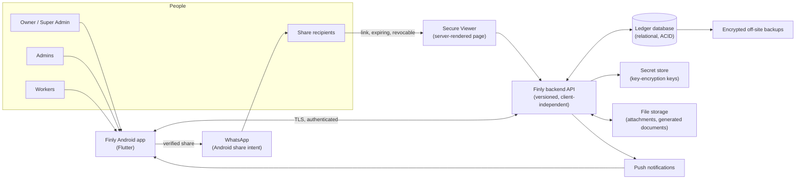

# Architecture

How Finly is built. §1–§3 are fixed by the [source documents](source/README.md). The container technologies in §2 are
chosen in the Stack Decision Record ([DECISIONS.md](DECISIONS.md), Gate 1). The schema, API contracts, encryption
and key design, and data-flow diagrams are completed at M1 (Gate 3).

## 1. Principles

1. **One database, one backend, one financial truth** for every client, now and future (A1). Clients hold no business
   rules that the backend does not also enforce; the backend never trusts a client.
2. **The backend is authoritative** for money, permissions, decryption, balances, ownership, posting, audit and security policy (A5).
3. **Requested operations in, computed results out.** The client sends "move ₹5,000 from Mint Bank to Tijori"; the
   backend validates, builds balanced journals, commits atomically and returns the authorised result (J1).
4. **Ledger first.** Every balance is a derivation of posted, balanced, hash-chained journal lines (AC0, AC7).
5. **Permission before data.** Authorization filters the dataset before aggregation, ranking, counting or rendering
   anything — totals, search, PDFs, messages, notifications (L12, Q2).
6. **Offline never bypasses truth.** The phone prepares; the server decides (P7).
7. **Configuration over code.** Firms, people, funds, accounts, types, rules, labels, roles, templates and policies are data (T1).
8. **Clean, one-way layering** on both sides, with no circular dependencies (add-on 02).

## 2. System context (C4 level 1)



The future web and iOS clients attach to the same API (Part Z).

## 3. The Flutter app's layers

```text
app/lib/
  core/            design system (generated tokens, Fy widgets), branding (from brand.json), routing, errors,
                   logging, secure storage, connectivity, lifecycle
  features/<f>/
    presentation/  screens and widgets — render state, send intents; no business rules
    application/   state and use-case orchestration (one place per feature)
    domain/        entities, value objects (Rupees, TransactionId…), pure rules shared with tests
    data/          API clients, DTOs, the encrypted offline cache and sync queue, repositories
```

- Presentation depends on application; application on domain; data implements domain interfaces. Domain depends on nothing.
- The money formatter, the split-remainder preview and other pure rules live in `domain` and are unit-tested; the
  backend recomputes every financial result anyway.
- Heavy work (crypto for the offline cache, image compression, PDF preview decoding) runs off the UI isolate.

## 4. The backend's layers (detailed at M1)

API surface (versioned, validated, rate-limited) → authentication and session/device checks → authorization and
discovery → use cases (posting pipeline, impact and conflict engine, share pipeline, reports) → accounting core
(posting-rule templates, journal builder, invariant checker, snapshots, hash chain, Integrity Verifier) →
persistence (one transaction per operation) → audit. Encryption and decryption are a service inside this boundary.

## 5. To be completed at M1

- C4 container and component diagrams with the approved technologies
- Data-flow diagrams for sensitive data; sequence diagrams for posting, sharing, sync and first login
- Database schema (ERD, tables, constraints, encryption map, index plan, invariants) — Gate 3
- API contracts and versioning; error model (stable codes, safe messages, correlation IDs)
- Encryption and key-management design; backup and restore design; observability plan
