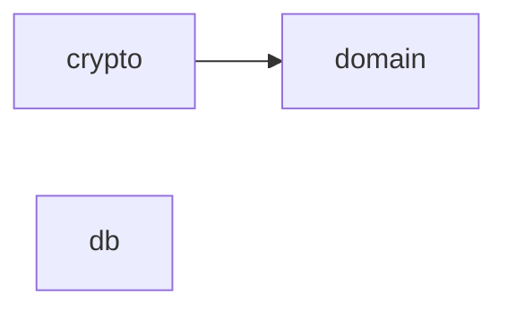

# Backend module map

Generated by `deno task arch:map` from [backend/arch/rules.ts](../../backend/arch/rules.ts) and the actual
imports in `backend/src`. Do not edit by hand: `tests/architecture/boundaries_test.ts` fails when this page is out
of date, when any import cycle appears, or when a layer imports what its rule does not allow (add-on 15 §2.2).

| Layer | Path | Files | Purpose | May import | Packages |
|---|---|---|---|---|---|
| domain | `src/domain/` | 10 | Accounting model and posting engine — pure and deterministic: no I/O, no keys; clock and randomness only in ids.ts (new ids) | — | — |
| crypto | `src/crypto/` | 4 | Encryption, blind indexes, hash chains, key ring (D-026, D-033) | `src/domain/errors.ts` | — |
| db | `src/db/` | 4 | PostgreSQL adapters, migration runner, SCRAM verifiers | — | `postgres`, `node:buffer`, `@electric-sql/pglite` |
| app | `src/app/` | 0 | Application services (posting, identity, policy): one use case per transaction, through ports | `src/domain/`, `src/crypto/`, `src/db/sql.ts` | — |
| http | `src/http/` | 0 | Versioned HTTP API: authentication, validation, error mapping; calls app services only | `src/app/`, `src/domain/errors.ts`, `src/domain/ids.ts`, `src/domain/money.ts` | `zod`, `jose` |

## Dependencies in use

Layers with no files yet are planned and already constrained by their rule.
