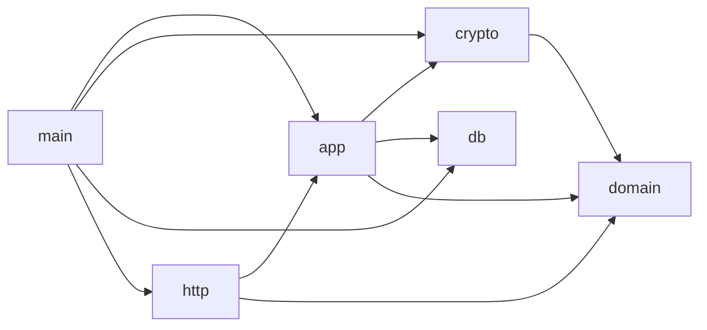

# Backend module map

Generated by `deno task arch:map` from [backend/arch/rules.ts](../../backend/arch/rules.ts) and the actual
imports in `backend/src`. Do not edit by hand: `tests/architecture/boundaries_test.ts` fails when this page is out
of date, when any import cycle appears, or when a layer imports what its rule does not allow (add-on 15 §2.2).

| Layer | Path | Files | Purpose | May import | Packages |
|---|---|---|---|---|---|
| domain | `src/domain/` | 12 | Accounting model and posting engine — pure and deterministic: no I/O, no keys; clock and randomness only in ids.ts (new ids) | — | — |
| crypto | `src/crypto/` | 6 | Encryption, blind indexes, hash chains, key ring, password hashing, session tokens (D-026, D-033, D-042) | `src/domain/errors.ts` | `hash-wasm` |
| db | `src/db/` | 5 | PostgreSQL adapters, migration runner, SCRAM verifiers | — | `postgres`, `node:buffer`, `@electric-sql/pglite` |
| app | `src/app/` | 13 | Application services (posting, identity, policy): one use case per transaction, through ports | `src/domain/`, `src/crypto/`, `src/db/sql.ts` | — |
| main | `src/main/` | 3 | Composition root: configuration, connections, keys and the services wired together; process entry points | `src/app/`, `src/crypto/`, `src/db/`, `src/domain/`, `src/http/` | `postgres` |
| http | `src/http/` | 3 | Versioned HTTP API: authentication, validation, error mapping; calls app services only | `src/app/`, `src/domain/errors.ts`, `src/domain/ids.ts`, `src/domain/money.ts` | `zod`, `jose` |

## Dependencies in use

Layers with no files yet are planned and already constrained by their rule.
