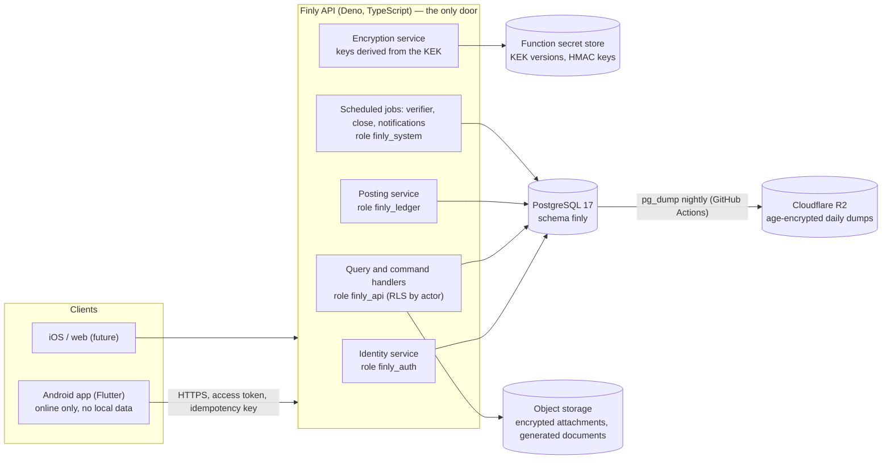

# 1. Database architecture

The authoritative design of Finly's database. It answers [add-on 11](../source/ADDON-11-database-architecture-schema.md)
items 1 (architecture), 7 (financial ledger model), 10–12 (money, keys, constraints), 17–19 (status, deletion,
periods), 21–25 (files, sharing, configuration, migrations, backup) and the normalisation register (item 6). The other
items have their own files; the index is [README.md](README.md).

Sources: [BUILD_PROMPT](../source/BUILD_PROMPT.md) Parts A, H, H-A, I, J, L, M, N, P7, Q, R, S, T, U;
RULEBOOK-01..03; the owner's gate responses; [DECISIONS.md](../DECISIONS.md); [ACCOUNTING-ENGINE.md](../ACCOUNTING-ENGINE.md).
Where two sources differ, the stricter security, privacy and integrity reading wins (A6.2).

## 1.1 What the database is for

The database is the **financial record of truth** for every client (Android now, iOS and web later, A1). It is not a
store behind CRUD screens. It holds:

1. **Master data** — what exists: entities (firms, people, pools, outside parties), funds, ledger accounts, money
   locations, categories, types, rules, roles, policies.
2. **Business events** — what happened in the real world: one master transaction per event with its legs (sources,
   destinations, allocations), its participants and its lifecycle.
3. **Accounting** — the consequence: one balanced, immutable, hash-chained journal per entity per step, journal lines
   carrying every dimension, open items and their settlements.
4. **Derived state, kept in step with the ledger** — encrypted balance snapshots, open-item remainders, holds.
5. **Control** — approvals, periods and closes, reconciliations, exceptions, integrity runs.
6. **Security and evidence** — identities, devices, sessions, access grants, share records, the tamper-evident audit log.

Nothing changes a balance except a posted, balanced, audited journal (AC0). The database refuses, by itself, the
mistakes it is able to recognise: updates to posted history, postings into closed periods, lines whose account belongs
to another entity, cross-environment reads by the wrong user.

## 1.2 Technology

**PostgreSQL 17** in our own `finly` schema, hosted on Supabase's free plan in Mumbai (D-013), with nothing
Supabase-specific in the ledger (S12): plain SQL, plain roles, plain row-level security, no extensions. The same
migrations run unchanged on any PostgreSQL 17 or later; tests run them on PGlite 0.5.8 (PostgreSQL 18.3 in
WebAssembly) and CI on a real PostgreSQL 17, the production version (D-028). Nothing PostgreSQL 18-only is used.

| Considered | Verdict |
|---|---|
| PostgreSQL / Supabase | ACID transactions, row locks, `FOR UPDATE`, deferred constraint triggers, row-level security, partial and composite indexes, `UNIQUE NULLS NOT DISTINCT`, generated columns, full-text search without extensions. Everything the ledger needs. **Chosen.** |
| Neon / any managed Postgres | Same engine; the migration path if Supabase stops fitting. Nothing in this design blocks it. |
| SQLite-class (D1, PocketBase) | No row-level locking, no RLS, weaker constraint machinery. Rejected (S1). |
| Firestore | No relational integrity for double entry. Rejected (S1). |

## 1.3 System architecture (diagram level 1)



Clients never connect to the database. The Supabase client roles (`anon`, `authenticated`, `service_role`) have **no
privileges at all** on schema `finly`; it is also absent from the exposed Data API schemas.

## 1.4 Database roles (least privilege)

All objects are owned by `finly_owner` (NOLOGIN; migrations run as it). Four group roles are granted to separate login
users created at deployment (passwords never in migrations or Git):

| Role | Used by | Can do | Cannot do |
|---|---|---|---|
| `finly_auth` | identity service | read/write identity tables: users, credentials, MFA, devices, sessions, refresh tokens, security events | read any financial or master table |
| `finly_api` | every request handler | read business tables **through RLS by actor**; write drafts, master data, shares, notifications, attachments metadata | read credential tables; `UPDATE`/`DELETE` posted history; bypass RLS |
| `finly_ledger` | the posting service: **every financial command** — submit, approve, post, reverse, correct, settle, hold, confirm a handover, close and reopen a month — each in one transaction under this one role | read what an authorised posting touches in any environment (the counterpart side of a mixed event); create events, legs, journals, lines, open items, settlements; update snapshots, holds, statuses | read credential tables; change posted lines; act without an actor (every policy requires `finly.actor_user_id`); serve query screens (they use `finly_api`) |
| `finly_system` | scheduled jobs (Integrity Verifier, period-close checks, notification fan-out, retention) | read everything needed for verification; write findings, runs, retention results | read credentials; update posted lines (one audited exception: key rotation re-encryption, §5) |

Every API transaction begins with `set_config('finly.actor_user_id', …, true)` (and session, device, request IDs),
transaction-local, so connection pooling can never carry an actor into another request.

**Two walls, honestly described.** The API's policy engine (Part L: RBAC + ABAC + resource, field, amount-visibility
and discovery rules) is the full authorisation model. Row-level security is the second wall: it enforces the boundaries
whose failure would be catastrophic — environment isolation (personal finance A4, RULEBOOK-03 §3–§6), hidden funds and
locations, own-user data — so that a missing `WHERE` clause or an IDOR bug in a read path returns nothing instead of
someone else's money. RLS does not defend against an attacker who can run arbitrary SQL as an API role; parameterised
queries, least-privilege roles and encryption do.

## 1.5 Domain modules

| Module | Tables | Owns |
|---|---|---|
| Platform | `schema_migration`, `system_setting`, `label_override`, `lookup_value`, `confidentiality_level`, `security_policy`, `emergency_control`, `retention_policy`, `key_version`, `reference_counter` | configuration, labels, policy, keys (metadata only), human reference numbers |
| Identity and security | `app_user`, `user_credential`, `mfa_factor`, `recovery_code`, `device`, `unlock_credential`, `auth_session`, `refresh_token`, `security_event` | who you are, how you prove it, where from |
| Authorisation | `role`, `permission`, `role_permission`, `user_role`, `env_access`, `access_rule`, `break_glass` | what you may do and see |
| Entities and masters | `entity_type`, `entity`, `person_profile`, `firm_profile`, `entity_membership`, `contact`, `category`, `txn_type`, `tag`, `place`, `expense_event`, `custom_field_def`, `custom_field_value`, `form_definition`, `approval_rule`, `notification_rule`, `message_template`, `report_definition`, `dashboard_config` | the configurable structure |
| Money structure | `coa_template_account`, `ledger_account`, `fund`, `location`, `bank_account_detail`, `location_ownership`, `location_access`, `location_holder`, `balance_hold` | where money can be and who controls what |
| Events and ledger | `txn`, `txn_status_transition`, `txn_entity`, `txn_leg`, `txn_note`, `txn_link`, `txn_tag`, `posting_rule_version`, `accounting_period`, `journal_chain_head`, `journal`, `journal_line`, `balance_slice`, `balance_current`, `balance_period`, `open_item`, `open_item_origin`, `settlement_allocation`, `custody_event`, `approval_request`, `period_close_run` | what happened and its accounting |
| Control | `reconciliation`, `bank_statement_import`, `bank_statement_line`, `exception_finding`, `integrity_run` | proving the books match reality |
| Files and sharing | `attachment`, `attachment_link`, `document`, `share_profile`, `share_request`, `share_event`, `secure_link`, `secure_link_access` | evidence in, proof out |
| Operations | `idempotency_record`, `notification`, `audit_log`, `audit_chain_head` | exactly-once requests, alerts, accountability |

Ninety-six tables (after migration 0010). The full list with purpose, keys and relationships is [03-schema.md](03-schema.md).

## 1.6 The financial ledger model (add-on 11 item 7)

### Two layers, one event

```text
real-world event ──► txn (one master transaction, TX-YYYYMMDD-NNNNNN)
                       ├─ txn_entity   who is involved (payer, owner, receiver, holder…) — drives visibility
                       ├─ txn_leg      the business description: sources, destinations, allocations (encrypted amounts)
                       ├─ txn_link     reverses / corrects / partially reverses / refunds another txn
                       ├─ approval_request, custody_event, attachment_link
                       └─ journal (one per entity per step, only when posted)
                            └─ journal_line  Dr/Cr, encrypted positive whole-rupee amount, every dimension
                                   │
              same DB transaction  ├─► balance_current / balance_period   (encrypted snapshots per slice)
                                   ├─► open_item                          (who owes whom, remaining)
                                   └─► settlement_allocation              (which payment closed which item)
```

- The **business layer** (`txn`, `txn_leg`) records WHO gave, FROM where, TO whom, FOR whom, WHY, HOW MUCH — including
  drafts and requests awaiting approval, which have no accounting yet.
- The **accounting layer** (`journal`, `journal_line`) records the consequence, produced only by the posting engine
  (`backend/src/domain/engine`) from the business layer. Debit and credit are never inferred from source and
  destination by a client (RULEBOOK-01 §72).
- A leg and the lines it produced are linked (`journal_line.txn_leg_id`), so an allocation of ₹30,000 to Mint can be
  traced to Mint's expense line and to Krish's receivable line.

### Ownership ≠ fund ≠ account ≠ location ≠ holder ≠ access

| Concept | Stored as | Never confused with |
|---|---|---|
| **Ownership** (whose money) | the entity whose books hold the line: `journal_line.entity_id` | where it is |
| **Fund** (which pool of that owner) | `journal_line.fund_id`, a fund of the same entity (composite foreign key) | the owner or the place |
| **Ledger account** (what kind of value) | `journal_line.ledger_account_id`, an account of the same entity (composite foreign key) | the user-facing "Account/Khata" |
| **Money location** (where it sits: Tijori, Savan Bank, cash with Sujal) | `journal_line.location_id` on cash, bank and wallet lines | ownership — one Tijori holds several owners' money |
| **Holder** (who had the key or the cash at posting time) | `journal_line.holder_person_id` snapshot + `location_holder` history | the owner, the handler, or access |
| **Access** (who may open the location) | `location_access` history (Add / Replace / Revoke) | the holder — giving the key to Krish does not change access (RULEBOOK-03 §13) |

"Where is Mint's money?" = Mint's asset slices grouped by location. "Whose money is in the Tijori?" = every entity's
asset slices at the Tijori location, limited to the entities the viewer may see (L12).

### Ledger invariants and where each is enforced

Amounts are encrypted (AC7), so the database cannot add them. Every invariant still has an owner:

| Invariant (AC6, ACCOUNTING-ENGINE §7) | Enforced by |
|---|---|
| ≥ 2 lines; at least one debit and one credit per journal and per fund | **database** — deferred constraint trigger at commit |
| Line's account and fund belong to the line's entity; line entity = journal entity | **database** — composite foreign keys |
| Required dimensions per account role (location on money lines, counterparty on party lines, category on income/expense) | **database** — insert trigger against `ledger_account` flags; engine |
| Posted journals and lines are immutable | **database** — triggers reject `UPDATE`/`DELETE`; privileges not granted |
| No posting into a closed period, to an inactive account, or while writes are frozen | **database** — journal insert trigger |
| Σ Dr = Σ Cr per journal, per entity, per fund; positive whole rupees | posting engine before commit (`checkJournal`), Integrity Verifier after |
| Σ allocations = Σ sources = total | posting engine; Integrity Verifier |
| Snapshots = recomputation from lines; reciprocity; sub-ledger = control; 0 ≤ remaining ≤ original | posting engine at commit; Integrity Verifier (scheduled, on demand, before every close) |
| Journals untampered | HMAC hash chain verified by the Integrity Verifier |

Any violation rejects the whole operation; the verifier never auto-fixes (AC6, AC7).

### Controlled denormalisation register (add-on 11 item 6)

Every copy of a fact in more than one place is listed here, with why, what, the source of truth, and how it stays
consistent. There are no others.

| Copy | Why | Source of truth | How it stays consistent |
|---|---|---|---|
| `balance_current`, `balance_period` (encrypted per slice) | Lines are encrypted; balances must be O(1) to read, not O(lines) to decrypt | `journal_line` | Written in the posting transaction under row locks and a version check; recomputed and compared by the Integrity Verifier; mismatch = critical exception, writes optionally frozen, never auto-fixed |
| `open_item.remaining_enc`, `open_item.status` | AC11 remaining is derived; decrypting every settlement on each read is too slow | `open_item.original_enc` − Σ `settlement_allocation` | Updated in the same transaction as the settlement, under the open item's row lock; verifier recomputes |
| `journal_line.entity_id`, `journal_line.value_date` | Index-only filtering and keyset pagination of statements without joining `journal` | `journal` | **Composite foreign key** `(journal_id, entity_id, value_date) → journal` — the database refuses any difference |
| `txn_entity.value_date` | List "Mint's transactions, newest first" from one index | `txn.value_date` | Composite foreign key `(txn_id, value_date) → txn ON UPDATE CASCADE` |
| `journal_line.holder_person_id` | "Who held the Tijori when this cash went in" must survive later holder changes | `location_holder` at posting time | Written once by the engine; lines are immutable |
| `txn_leg.amount_bidx`, `txn_leg.amount_bucket` | Search by amount over encrypted values | `txn_leg.amount_enc` | Computed by the encryption service in the same write; the leg is frozen after submission |
| `journal_chain_head`, `audit_chain_head` | Serialise the hash chains without scanning | last chained row | Locked and updated in the same transaction as the appended row |

### Money and numeric types (add-on 11 item 10)

- **Currency:** INR only. `txn.currency char(3) default 'INR' check (currency = 'INR')`. Foreign currency, when built,
  adds `original_amount_minor bigint`, `original_currency`, `fx_rate numeric(20,10)` to legs; the INR base amount stays
  a whole rupee and any difference goes to an explicit rounding or exchange line (RULEBOOK-01 §49–§50).
- **Precision and scale:** whole rupees, scale 0, range 1 … 999,999,999,999 (`MAX_AMOUNT`), as `bigint` in the engine.
  No `real`, `double precision`, `money` or `numeric` with a fractional scale anywhere in a money path.
- **At rest:** each amount is a fixed-width 8-byte big-endian integer, encrypted with AES-256-GCM (12-byte random
  nonce, 16-byte tag, associated data `finly:v1:<table>.<column>:<row id>`), stored as `bytea` with its `key_version`.
  Fixed width means ciphertext length reveals nothing about magnitude; the associated data means a ciphertext cannot be
  copied to another row or column.
- **Signed values** (balances) use the same encoding as a two's-complement int64. Line amounts are always positive;
  direction is the `side` column.
- **Rounding:** none is ever implicit. Splits by percentage or ratio use the largest-remainder method with the
  first-listed part winning ties (AC10, revision 3 A8); manual allocations are exact and must add up or are refused.

### Keys and identifiers (add-on 11 item 8)

- **Primary keys:** `uuid` everywhere, UUIDv7 (time-ordered, so B-tree inserts stay local). The API generates them;
  `finly.uuid_v7()` is the SQL default for seeds. `bigint generated always as identity` only for append-only logs
  (`audit_log`, `security_event`, `secure_link_access`) where order matters and IDs are never exposed.
- **Business identifiers** (human, unique, never reused): `txn.reference` `TX-YYYYMMDD-NNNNNN`, `open_item.reference`
  `OI-…`, `share_request.reference` `SH-…`, `reconciliation.reference` `RC-…`. Allocated from `reference_counter`
  inside the same transaction, so numbering has no gaps.
- **Names are data, never identity.** Mint, JSK, Krish, Tijori are editable `display_name`/`name` values over stable
  UUIDs. System-meaningful values use immutable `key` columns (`'cash'`, `'owner'`, `'txn.create'`) that code may refer
  to; labels over them are configurable.
- **Referential actions:** `ON DELETE RESTRICT` (the default `NO ACTION`) everywhere history is involved — financial and
  master rows are archived, never deleted. `ON DELETE CASCADE` only for pure children of a parent that can itself be
  deleted (drafts' legs when a never-submitted draft is discarded is **not** one: drafts are cancelled, not deleted).
  `ON UPDATE CASCADE` only on the denormalised composite keys above.
- **Type-safe relationships:** where a column must reference an entity of a particular kind (a membership's firm must be
  a firm), the table carries a generated constant column and a composite foreign key to `entity (id, kind)`, so the
  database itself refuses a person in a firm's place.

## 1.7 Status and lifecycle (add-on 11 item 17)

Fixed engine states are `text` with `CHECK` constraints (easy to extend by migration, unlike enum types); labels over
them are configurable (P8). The master-transaction state machine is enforced by a trigger against the
`txn_status_transition` table.

```mermaid
stateDiagram-v2
  [*] --> draft
  draft --> pending_approval: submit (rule requires approval)
  draft --> posted: submit (no approval needed; validated + posted atomically)
  draft --> cancelled
  pending_approval --> approved
  pending_approval --> rejected
  pending_approval --> draft: withdrawn (approvals reset)
  pending_approval --> cancelled
  approved --> posted: posted atomically after re-validation
  approved --> failed: re-validation failed (e.g. balance changed)
  approved --> cancelled
  failed --> draft
  failed --> posted: retried
  failed --> cancelled
  posted --> reversed: mirror journals posted
  posted --> corrected: reversal + replacement posted
  rejected --> [*]
  cancelled --> [*]
  reversed --> [*]
  corrected --> [*]
```



*Validating* and *Posting* (J5) happen inside one database transaction and are never committed as states: either the
whole posting commits as `posted`, or nothing changes. A posted transaction's legs and journals never change again;
only its status moves to `reversed` or `corrected`, together with the linked mirror.

| Record | States |
|---|---|
| Master data (entities, funds, accounts, locations, categories, types, roles…) | `active` → `inactive` (hidden from new use, history intact) → `archived`; `restore` back to active |
| `open_item` | `open` → `partially_settled` → `settled`; `written_off`; `reversed` (origin reversed) |
| `custody_event` | `recorded` (confirmation OFF, F2) · `awaiting_confirmation` → `confirmed` / `disputed` / `cancelled` |
| `approval_request` | `pending` → `approved` / `rejected` / `withdrawn` / `superseded` |
| `accounting_period` | `open` → `closed` (→ `open` again only by an authorised, audited reopen) |
| `reconciliation` | `draft` → `investigating` → `resolved` (no difference) / `adjustment_pending` → `adjusted` → `closed` |
| `share_request` | `draft` → `previewed` → `recipient_verified` → `confirmed` → `handed_off`; `cancelled`, `failed`, `invalidated` |
| `exception_finding` | `open` → `acknowledged` → `resolved` / `dismissed` |
| `app_user` | `invited` → `active` ⇄ `suspended`; `disabled`; `archived` |
| `device` | `pending` → `trusted` → `revoked` / `lost` |

## 1.8 Deletion and archiving policy (add-on 11 item 18)

| Data | Policy |
|---|---|
| Posted transactions, journals, lines, settlements, open items, snapshots | **Never deleted.** Corrected by reversal, correction or adjustment (H15, RULEBOOK-03 §62). `DELETE` is not granted and a trigger refuses it. |
| Drafts, pending approvals | Cancelled (status), never deleted, so the audit trail and sync stay simple. The only `DELETE` privilege in Finly: the legs and tags of the actor's own draft while it is still a draft. |
| Master data with history (entities, funds, ledger accounts, locations, categories, users) | Inactive → archived; rename is a label change over the stable ID. Never deleted once referenced; an unreferenced master created by mistake may be archived immediately. |
| Access grants, holders, ownership of locations | Ended (`revoked_at`, `valid_to`), never deleted — history is the point (F5). |
| Audit log, security events, hash chains | Append-only; retention per `retention_policy` (proposed 8 years, open question Q8). |
| Sessions, refresh tokens, idempotency records | Expire; a retention job removes expired rows after their retention window (they carry no financial history). |
| Attachments | Replaced or removed by status (`replaced`, `removed`, audited); the blob is deleted only after the financial retention period. |
| Generated documents, secure links | Expire and are revoked by status; blobs removed after their own retention (Q8 honest limitation). |

## 1.9 Periods and closing (add-on 11 item 19)

- `accounting_period` per entity per month (`period_start`, `period_end`, `status`). Fiscal year April–March for year-end
  closing (open question Q9).
- A journal's period is chosen by its value date. The journal insert trigger refuses a closed period. Corrections for a
  closed period post in the current open period and reference the original (AC8).
- Close: `period_close_run` stores the Month Close Assistant checklist (trial balance, sub-ledgers, reconciliations,
  suspense, OBE, reciprocity, pending approvals, verifier) and the outcome (clean / needs review / critical). Closing
  journals (`journal.kind = 'closing'`) roll income and expense into retained earnings per fund (F4). Each slice's
  `balance_period.closing_enc` is fixed at close and becomes the next period's opening.
- Reopen: high privilege + reason + step-up; recorded as a `period_close_run` of kind `reopen` and in the audit log.
- **Order is enforced by the database:** a month closes only when every earlier month of that entity is closed, and
  reopens only when every later month is open, so "closing balance = next opening" can never be broken. The journal
  insert trigger takes the period row `FOR SHARE`, so a posting and a close of the same month serialise.

## 1.10 Files and proof (add-on 11 item 21)

- **Blobs never live in the database.** `attachment` and `document` rows hold metadata only: object key (random, not
  guessable), content type, size, SHA-256, kind, status, and — for sensitive files — the wrapped per-file key and key
  version (files are encrypted before upload).
- Attachments link to what they evidence through `attachment_link`, which has one nullable foreign key per possible
  target and `CHECK (num_nonnulls(...) = 1)` — real foreign keys instead of an unenforceable `target_type, target_id`.
- Downloads are short-lived signed URLs issued by the API after authorisation; every access is audited (U1).
- Generated proof (Message, Photo Proof, PDF, Secure PDF) is a `document` produced from authorised data; regeneration
  creates a new row (`supersedes_document_id`), never an overwrite.

## 1.11 Sharing (add-on 11 item 22)

`share_request` binds one verification to `content_hash` + recipient + format + visible fields + security
configuration + expiry in `verification_hash`. Any change → status `invalidated`, a new request and a new review (A3,
Q3). `share_event` records every state change with actor, step-up method and time; `secure_link` holds only the hash of
the viewer token, expiry and revocation; `secure_link_access` logs every view attempt. WhatsApp hand-off is recorded
as `handed_off`, never "sent" (S6). Details: [02-erd.md](02-erd.md) level 5.

## 1.12 Configuration and master data (add-on 11 item 23)

Firms, people, roles, categories, transaction types, funds, accounts, locations, tags, statuses' labels,
confidentiality levels, workflows and approval rules, share profiles, templates, forms and custom fields are all rows.
Simple label lists (location types, payment methods, fund kinds, event kinds, document kinds, worker types) share one
`lookup_value` table made type-safe by a composite foreign key on `(list_key, id)`; lists with behaviour (entity types,
categories, transaction types, confidentiality levels) have their own tables. Every configuration change that affects
money or security is versioned (`version` column) and audited (T1).

## 1.13 Migrations (add-on 11 item 24)

- Plain SQL files in `backend/db/migrations/NNNN_name.sql`, applied in order by our own runner, each in one
  transaction, recorded in `finly.schema_migration` with a SHA-256 checksum; a changed applied file fails the run.
- Forward-only. Destructive changes follow expand → migrate → contract across releases; dropping a table or column
  that ever held financial data is not allowed. Each file's header states purpose, data impact and how to recover.
- Every migration is tested: the suite applies all migrations to an empty database (PGlite in tests, PostgreSQL 17 in
  CI), then checks the catalog — RLS and at least one policy on every table, nothing granted to PUBLIC, no credential
  access for the API role, no DELETE beyond draft legs, every table commented, every table of 03 present and nothing
  else, seeds and kind lists equal to the engine's — and runs the database tests (`backend/tests/db/`).
- Production: backup first (§1.14), apply, run the Integrity Verifier, smoke-test. A failed migration rolls back as a
  whole; a bad but successful one is fixed forward, or the database is restored from the pre-migration backup.

## 1.14 Backup and recovery (add-on 11 item 25)

| Need | Design |
|---|---|
| Automated | GitHub Actions nightly `pg_dump --format=custom` of the production database (D-015, S9) |
| Encrypted | `age` to the owner's public key; the private key stays offline with the owner; uploaded to Cloudflare R2 |
| Keys not in the same place | The database holds **no key material** — only key version numbers. Encryption keys are derived (HKDF) from the KEK in the function secret store. A dump without the KEK reveals no amounts; the KEK is escrowed offline by the owner, separately from the backup key |
| Integrity | SHA-256 of each dump recorded beside it; the restore drill verifies it |
| Retention | 30 daily, 12 monthly, 7 yearly (proposed, Q8) |
| Recovery tested | Monthly drill: restore the latest dump into a fresh PostgreSQL 17, run all migrations' catalog checks and the Integrity Verifier (balances, hash chains, reciprocity), then the API smoke tests |
| Before every migration | An on-demand backup; recovery = restore it and replay nothing (the API is paused during a production migration) |
| Accidental deletion | Financial rows cannot be deleted; master data is archived; worst case restore + compare |
| Corruption or tampering | Hash chains locate the first bad journal or audit row; restore the last good backup; the gap is re-entered from evidence |
| Losing the KEK | **Unrecoverable encrypted amounts.** Hence the offline escrow and a yearly escrow test (open question Q3) |
