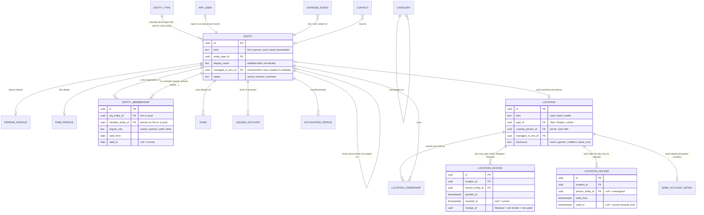
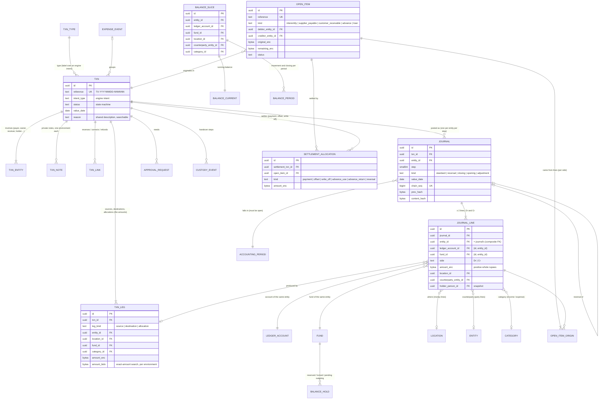
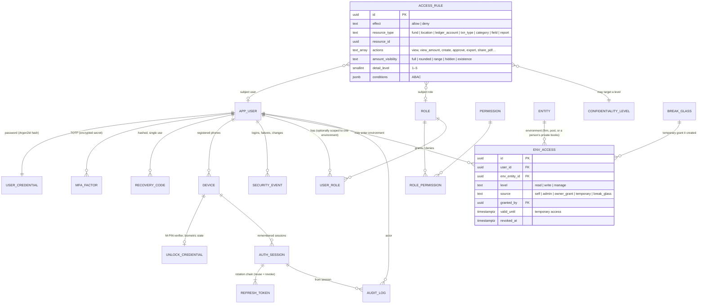
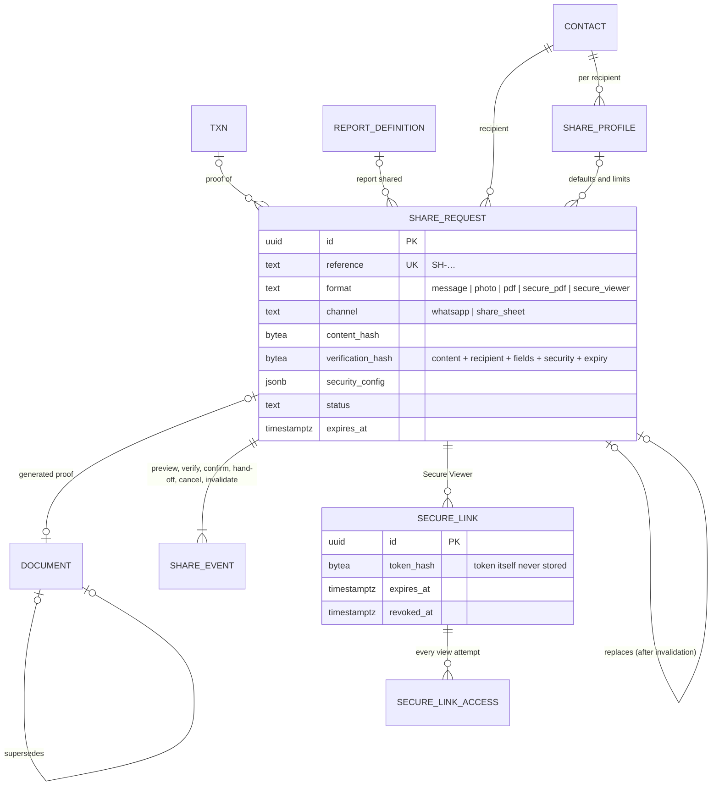

# 2. Entity–relationship diagrams and relationship map

Add-on 11 items 7 (complete ERD), 6 of §30 (relationship map) and 27 (diagram levels 1–6). Level 1 (system
architecture) is in [01-architecture.md §1.3](01-architecture.md#13-system-architecture-diagram-level-1). Cardinality
notation (Mermaid): `||` exactly one, `o|` zero or one, `|{` one or more, `o{` zero or more. A solid line is an
identifying (required) relationship, a dotted line a non-identifying or optional one.

Column-level detail is in [03-schema.md](03-schema.md); the diagrams show keys and the columns that carry meaning.

## Level 2 — Domain model

The business world: who exists, how they relate, where money can be, who controls it.

- A person may be an owner of one firm, a partner of another and a worker of a third (RULEBOOK-03 §2): several
  `entity_membership` rows, one person entity, one user at most.
- Two people are never merged: each is its own `entity` with its own books (RULEBOOK-03 §5).
- A worker created by Partner 1 lives in Partner 1's environment (`managed_in_env_id`); Partner 2 sees it only with access
  to that environment (RULEBOOK-03 §6).

## Level 3 — Financial model

From a real-world event to the ledger, balances, obligations and settlement.

How the ₹45,000 Angadiya expense paid by Krish lands (Mint ₹30,000 + JSK ₹5,000 + Personal ₹10,000):

| Table | Rows |
|---|---|
| `txn` | 1 (TX-…, intent `expense`; no amount on the header — the total is the source leg) |
| `txn_entity` | Krish (payer, owner), Mint (owner), JSK (owner) |
| `txn_leg` | 1 source (Krish, Krish savings, ₹45,000) · 3 allocations (Mint ₹30,000 hotel, JSK ₹5,000 travel, Krish ₹10,000 food) |
| `journal` | 3 — Mint, JSK, Krish |
| `journal_line` | Mint: Dr expense / Cr inter-entity payable (cp Krish) · JSK: same, ₹5,000 · Krish: Dr expense ₹10,000, Dr receivable (cp Mint) ₹30,000, Dr receivable (cp JSK) ₹5,000 / Cr Bank (Krish savings) ₹45,000 |
| `open_item` | Mint owes Krish ₹30,000 · JSK owes Krish ₹5,000 |
| `balance_current` | the 8 slices those lines touch |

A Mint-only viewer can see the event, Mint's journal and Mint's allocation leg; Krish's personal ₹10,000 leg and
Krish's journal are invisible to them by row-level security (A4).

## Level 4 — Security model

- **System administration ≠ financial visibility** (A4): roles grant capabilities; environments are entered only through
  `env_access`. A trigger refuses any grant on a person's private environment unless the granting user *is* that person
  (owner grant), so no Super Admin can grant themselves someone's personal finance (T2).
- Precedence (L8): explicit deny > explicit allow > role default, evaluated by the API policy engine; RLS mirrors the
  deny side for funds and locations.

## Level 5 — Sharing model

## Level 6 — Detailed schema (all tables)

Every table and every foreign key. Arrows point from the referencing table to the referenced one.

```mermaid
flowchart LR
  subgraph platform[Platform]
    schema_migration; system_setting; label_override; lookup_value; confidentiality_level; security_policy
    emergency_control; retention_policy; key_version; reference_counter
  end
  subgraph identity[Identity]
    app_user; user_credential; mfa_factor; recovery_code; device; unlock_credential; auth_session; refresh_token; security_event
  end
  subgraph authz[Authorisation]
    role; permission; role_permission; user_role; env_access; access_rule; break_glass
  end
  subgraph masters[Entities and masters]
    entity_type; entity; person_profile; firm_profile; entity_membership; contact; category; txn_type; tag; place
    expense_event; custom_field_def; custom_field_value; form_definition; approval_rule; notification_rule
    message_template; report_definition; dashboard_config
  end
  subgraph money[Money structure]
    coa_template_account; ledger_account; fund; location; bank_account_detail; location_ownership; location_access
    location_holder; balance_hold
  end
  subgraph ledgerm[Events and ledger]
    txn; txn_status_transition; txn_entity; txn_leg; txn_note; txn_link; txn_tag; posting_rule_version
    accounting_period; journal_chain_head; journal; journal_line; balance_slice; balance_current; balance_period
    open_item; open_item_origin; settlement_allocation; custody_event; approval_request; period_close_run
  end
  subgraph control[Control]
    reconciliation; bank_statement_import; bank_statement_line; exception_finding; integrity_run
  end
  subgraph files[Files and sharing]
    attachment; attachment_link; document; share_profile; share_request; share_event; secure_link; secure_link_access
  end
  subgraph ops[Operations]
    idempotency_record; notification; audit_log; audit_chain_head
  end

  app_user --> entity
  user_credential --> app_user
  mfa_factor --> app_user
  recovery_code --> app_user
  device --> app_user
  unlock_credential --> device
  auth_session --> device
  refresh_token --> auth_session
  security_event --> app_user
  role_permission --> role
  role_permission --> permission
  user_role --> app_user
  user_role --> role
  user_role --> entity
  env_access --> app_user
  env_access --> entity
  env_access --> break_glass
  access_rule --> app_user
  access_rule --> role
  access_rule --> confidentiality_level
  break_glass --> app_user
  entity --> entity_type
  entity --> confidentiality_level
  person_profile --> entity
  person_profile --> lookup_value
  firm_profile --> entity
  entity_membership --> entity
  contact --> entity
  category --> category
  expense_event --> entity
  expense_event --> lookup_value
  custom_field_value --> custom_field_def
  form_definition --> txn_type
  approval_rule --> txn_type
  approval_rule --> entity
  report_definition --> app_user
  dashboard_config --> app_user
  ledger_account --> entity
  ledger_account --> ledger_account
  fund --> entity
  fund --> lookup_value
  location --> lookup_value
  location --> entity
  location --> confidentiality_level
  bank_account_detail --> location
  location_ownership --> location
  location_ownership --> entity
  location_access --> location
  location_access --> entity
  location_holder --> location
  location_holder --> entity
  balance_hold --> fund
  balance_hold --> location
  balance_hold --> txn
  txn --> txn_type
  txn --> entity
  txn --> expense_event
  txn --> app_user
  txn --> txn_status_transition
  txn_entity --> txn
  txn_entity --> entity
  txn_leg --> txn
  txn_leg --> entity
  txn_leg --> location
  txn_leg --> fund
  txn_leg --> category
  txn_link --> txn
  txn_note --> txn
  txn_note --> entity
  open_item_origin --> open_item
  open_item_origin --> journal_line
  txn_tag --> txn
  txn_tag --> tag
  accounting_period --> entity
  journal --> txn
  journal --> entity
  journal --> accounting_period
  journal --> posting_rule_version
  journal --> journal
  journal_line --> journal
  journal_line --> ledger_account
  journal_line --> fund
  journal_line --> location
  journal_line --> entity
  journal_line --> category
  journal_line --> expense_event
  journal_line --> txn_leg
  balance_slice --> ledger_account
  balance_slice --> fund
  balance_slice --> location
  balance_slice --> category
  balance_current --> balance_slice
  balance_period --> balance_slice
  balance_period --> accounting_period
  open_item --> txn
  open_item --> entity
  settlement_allocation --> open_item
  settlement_allocation --> txn
  custody_event --> txn
  custody_event --> location
  custody_event --> fund
  approval_request --> txn
  approval_request --> approval_rule
  approval_request --> app_user
  period_close_run --> accounting_period
  reconciliation --> location
  reconciliation --> entity
  reconciliation --> txn
  bank_statement_import --> location
  bank_statement_line --> bank_statement_import
  bank_statement_line --> txn
  exception_finding --> entity
  exception_finding --> integrity_run
  attachment --> entity
  attachment_link --> attachment
  attachment_link --> txn
  attachment_link --> reconciliation
  attachment_link --> custody_event
  attachment_link --> expense_event
  document --> txn
  document --> report_definition
  document --> document
  share_profile --> contact
  share_request --> txn
  share_request --> contact
  share_request --> share_profile
  share_request --> document
  share_event --> share_request
  secure_link --> share_request
  secure_link_access --> secure_link
  idempotency_record --> app_user
  notification --> app_user
  audit_log --> app_user
  audit_log --> txn
```

## Relationship map (add-on 11 §30 item 6)

| Relationship | Cardinality | Required? | Implemented by | On delete |
|---|---|---|---|---|
| user → person entity | 1 : 1 | yes (every user is a person) | `app_user.person_entity_id` unique, composite FK to `entity (id, kind='person')` | restrict |
| entity → environment it was created in | n : 0..1 | no (top-level firms and users' own person entities have none) | `entity.managed_in_env_id` | restrict |
| organisation ↔ member | m : n over time | — | `entity_membership` (junction with history) | restrict |
| entity → funds | 1 : n, exactly one default | yes (≥ 1) | `fund.entity_id`; partial unique index on default | restrict |
| entity → ledger accounts | 1 : n | yes (from template) | `ledger_account.entity_id`; unique `(entity_id, code)` | restrict |
| location → owner (over time) | n : 1 per period | optional (unowned allowed) | `location_ownership` with one open row | restrict |
| location ↔ people with access | m : n over time | optional | `location_access` | restrict |
| location → current holder | 1 : 0..1 at a time | optional (unassigned) | `location_holder`, exactly one open row (person may be null) | restrict |
| txn → participants | 1 : n | yes (≥ 1) | `txn_entity` | restrict |
| txn → legs | 1 : n | yes (≥ 1 when submitted) | `txn_leg` | restrict |
| txn → journals | 1 : 0..n (0 until posted) | when posted | `journal.txn_id` | restrict |
| journal → lines | 1 : 2..n | yes (≥ 2, deferred check) | `journal_line.journal_id` | restrict |
| line → account / fund of same entity | n : 1 | yes | composite FKs `(ledger_account_id, entity_id)`, `(fund_id, entity_id)` | restrict |
| line → location, counterparty, category | n : 0..1 | per account role (trigger) | FKs | restrict |
| txn ↔ txn (reverse, correct, refund) | m : n | — | `txn_link` (a txn is fully reversed at most once) | restrict |
| open item → origin event and lines | n : 1 event, 1 : n lines | yes | `open_item.origin_txn_id`; `open_item_origin` junction to each side's lines | restrict |
| open item ↔ settling txns | m : n | — | `settlement_allocation` (junction with amount) | restrict |
| attachment ↔ evidence target | m : n | — | `attachment_link` (one FK per target type, exactly one set) | restrict |
| share request → recipient, document | n : 1 | recipient yes, document per format | FKs | restrict |
| audit row → actor, txn, approval, share | n : 0..1 | — | FKs | restrict |
